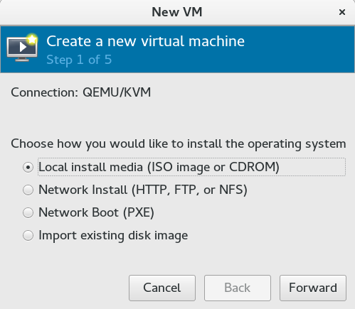
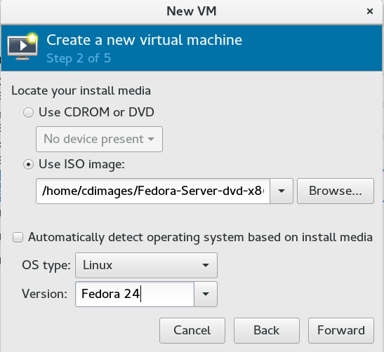
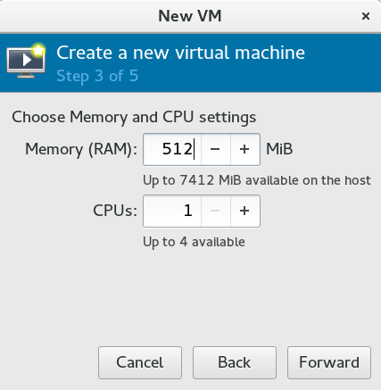
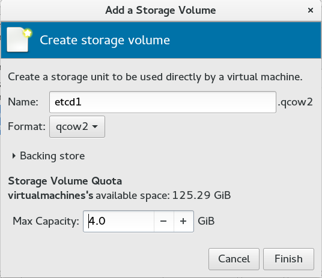
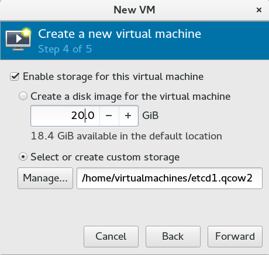
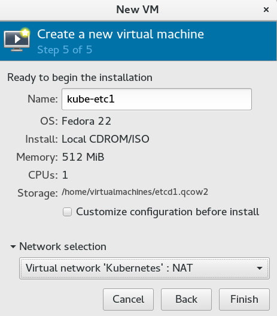
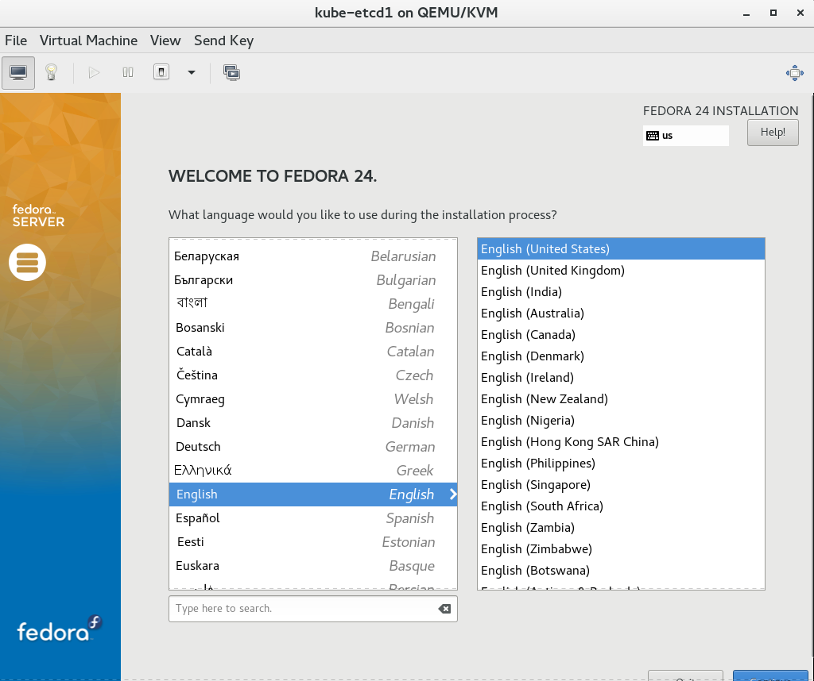
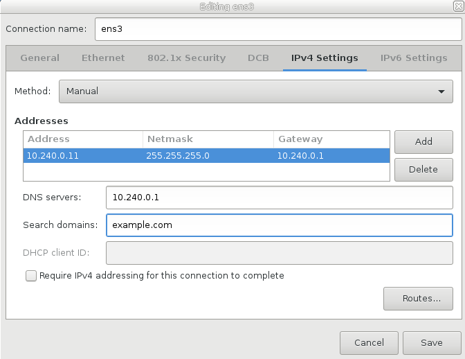

Kubernetes ebook
# Chapter 2: Infrastructure design and provisioning

**todo- editor**: I have merged chapter 2 and 3 (from the original outline) together to form chapter 2.

* Write about what type of hardware is needed. If not physical hardware, then what size of VMs are needed. etc.
* Discuss what type of network technologies are we going to use. Such as flannel or CIDR, etc.
* This will be a relatively short chapter.
* (# Chapter 3: Provisioning of machines, Network setup)
* Here we provision our machines, and also setup networking.
* This will have a couple of diagrams

This chapter will discuss how we setup our infrastructure. The setup we are using is VMs running on Libvirt/KVM on my local work computer, which is the closest to bare-metal installation if one does not have actual bare-metal hardware. It is still possible to run this setup on AWS or GCE or any other cloud provider of your choice though. You should also note that the networking component is a little different for each cloud provider. 


## How many VMs and what size?

As we know from [chapter 1](chapter01.md), Kubernetes has three main components. These three components are:

* Etcd 
* Control plane (comprising of: API Server, Scheduler, Controller Manager) 
* Worker(s) 

It is technically possible to have all these components on a single machine; though a minimum of three nodes are recommended, one for each component. Even if you use a dedicated node for each component, there would be no high availability though and no traffic coming in from outside (unless you use something called *NodePort* - more about this later). To make sure that the incoming traffic can reach the pods, we also need an additional component called a load balancer. In my opinion it is a component which is missing from the Kubernetes software at the moment. Just like when you buy a camera, an important component of the camera is missing, which is called a **tripod** :). You need to additionally buy this missing component when you buy a camera. Similarly you need to setup/add a load balancer when you setup a Kubernetes cluster.

Since we hope to have high availability not only for our pods, but also for other components of our cluster, we would be using the following number and size of the nodes.

* 3 x Etcd nodes -		Each with: 0.5 GB RAM, 4 GB disk 
* 2 x Control plane nodes -	Each with: 0.5 GB RAM, 4 GB disk 
* 2 x Worker nodes - 		Each with: 1.5 GB RAM, 20 GB disk
* 2 x Load Balancer nodes -	Each with: 0.5 GB RAM, 4 GB disk

That makes a total of nine (9) nodes.


Though not abolsulutely necessary, we also need a shared storage solution to demonstrate the concept of network mounted volumes (todo - ????) . We *can* use the Load balancer nodes to setup NFS and make it Highly available.

**Note about NodePort:**
In Kubernetes, `NodePort` is way to expose a service to the outside world - when you specify it in the `kubectl expose <service> --type=NodePort` (todo - confirm / verify). What this does is that it allows you to expose a service on the worker node, just like you can do the port mapping on a simple docker host. This makes the service available through all the worker nodes, because node port works it's magic by setting up certain iptables rules on all worker nodes. So no matter which port you land on (from outside the cluster), the service responds to you. However, to do this, you need to have the external DNS pointing to the worker nodes. e.g. www.example.com can have two A type addresses in DNS pointing to the IP addresses of two worker nodes. In case a node fails, DNS will do it's own DNS round robin. This may work, but DNS round robin does not work well with sticky sessions. Also, managing services through ports is kind of difficult to manage / keep track of. Plus it is totally uncool! (todo: editor can remove this if unhappy :(  ).


## The choice of HA technology for etcd, controllers and load balancers:

We selected three nodes for the etcd service. First, because it stores the meta data about our cluster, which is most important. Secondly etcd nodes can form their own individual/independent cluster. To satisfy the needs of a quorum, we decided to use three nodes for etcd cluster. This means failure of one node does not affect the etcd operation. (todo: rewrite:) In order for etcd cluster to be healthy, it needs to have quorum. i.e. alive nodes being more than half of the size of the total number of nodes of etcd cluter. So having a total of two nodes is not helpful. When one fails, the etcd custer will instantly become unhealthy. This is what we do not want to happen in a production cluster.

We know that all Kubernetes components watch the API server, running on controller node. So making sure that control plane remains available at all times. Unfortunately, controller nodes are not cluster aware. So we need to provide some sort of HA for them. This high availability can be provided in two ways. 

* By setting up a proxy/load balancer (using HAProxy on our load balancer). This would mean that the load balancer has to be the first component to come alive when the cluster boots up. So cluster has dependency on the load balancer nodes. This is easier to setup but has dependency problem.
* By setting up IPVS/LVS (using heartbeat, etc) on the controller nodes themselves, and only have a floating IP/VIP on the two nodes. This way we do not have to wait for the load balancer to come up before the rest of the cluster. We then use this *Controller VIP* in the worker nodes to point to controller node. This involves installing and configuring some HA software on controller nodes, but does not have dependency problems.

We believe the second method holds more value, so we go for it. Although just for completeness sake, we will also show a method to do it through HAProxy.

(todo: Load balancers use: (using IPVS/LVS + Heartbeat))


**todo:** In case we use IPVS, would we need additional STONITH device to prevent split brain syndrome? 


## DNS names:
It is understood that all nodes in this cluster will have some hostname assigned to them. It is important to have consistent hostnames, and if there is a DNS server in your infrastructure, then it is also important what are the reverse lookup names of these nodes. This information is  critical at the time when you will generate SSL certificates. 

The dns domainname we will use in this setup is `example.com` . Each node will have a hostname in the form of `*hostname*.example.com` . 


## Operating System:
We are using Fedora 24 64 bit server edition - on all nodes (Download from [here](https://getfedora.org/en/server/download/) ). You can use a Linux distribution of your choice. 
For poeple wanting to use Fedora Atomic, we would like to issue a warning. Fedora Atomic is a collection of binaries (etcd, kubernetes) bundled together (in a read only  filesystem), and individual packages *cannot* be updated. There is no yum/dnf, etc. In this book we are using Kubernetes 1.3 (the latest version), which is still not part of Fedora Atomic 24, so we decided to use Fedora 24 server edition (in minimal configuration), and added the packages we need directly from their official websites.

## Supporting software needed for this setup:
* Kubernetes - 1.3.0 or later (Download latest from Kubernetes website)
* etcd - 2.2.5 or later (The one that comes with Fedora is good enough)
* Docker - 1.11.2 or later (Download latest from Docker website)
* CNI networking [https://github.com/containernetworking/cni](https://github.com/containernetworking/cni)
* Linux IPVS, heartbeat / pacemaker (todo) 


## Expectations

With the infrastructure choices made above, we have hope to have the following working on our Kubernetes cluster.

* 3 x etcd nodes (in H/A configuration) 
* 2 x Kubernetes controller nodes (in H/A configuration) 
* 2 x Kubernetes worker nodes
* SSL based communication between all Kubernetes components
* Internal Cluster DNS (SkyDNS) - as cluster addon
* Default Service accounts and Secrets
* Load Balancer (in H/A configuration)


Before we start building VMs, we would like to hightlight few things about Kubernetes networking.

## Kubernetes Networking:
Kubernetes uses three different types of networks. They are:

* Infrastructure Network: The network your physical (or virtual) machines are connected to. Normally your production network, or a part of it.
* Service Network: The (completely) virtual (rather fictional) network, which is used to assign IP addresses to Kubernetes Services, which you will be creating. (A Service is a frontend to a RC or a Deployment). It must be noted that IP from this network are **never** assigned to any of the interfaces of any of the nodes/VMs, etc. These (Service IPs) are used behind the scenes by kube-proxy to create (weird) iptables rules on the worker nodes. 
* Pod Network: This is the network, which is used by the pods. However it is not a simple network either, depending on what kubernetes network solution you are employing. If you are using flannel, then this would be a large software defined overlay network, and each worker node will get a subnet of this network and configured for it's docker0 interface (in very simple words, there is a little more to it). If you are employing CIDR network, using CNI, then it would be a large network called **cluster-cidr** , with small subnets corresponding to your worker nodes. The routing table of the router handling your part of infrastructure network will need to be updated with routes to these small subnets. This proved to be a challenge on AWS VPC router, but this is piece of cake on a simple/generic router in your network. I will be doing it on my work computer, and setting up routes on Linux is a very simple task.

Kelsey used the following three networks in his guide, and I intend to use the same ones, so people following this guide, but checking his guide for reference are not confused in different IP schemes. So here are my three networks , which I will use for this guide.

* Infrastructure network:     10.240.0.0/24 
* Service Network:            10.32.0.0/24 
* Pod Network (Cluster CIDR): 10.200.0.0/16 


# Infrastructure layout / network layout:

Building upon the information we have gathered so far, especially about the Kubernetes networking, we have designed our cluster to look like this: 


# Infrastructure provisioning

Note that I am doing this provisioning on my work computer, which is Fedora 23 64 bit, and I will use the built in Libvirt/KVM for virtualization. You can use any other virtualization software, or use real hardware!

First, setting up the new infrastructure network in KVM.

If you use libvirt, then you probably know that libvirt sets up a virtual network `192.168.124.0/24` and sets it up as default. We wanted to be Kelsey's guide as possible (todo: editor, should we mention that?), so my infrastructure network is going to be `10.240.0.0/24` . I will just create a new virtual network (10.240.0.0/24) on my work computer.

## Setup new virtual network in KVM:

Start Virtual Machine Manager and go to "Edit"->"Connection Details"->"Virtual Networks" . Then follow the steps shown below to create a new virtual network and name it **Kubernetes**. Note that this is a NAT network, connected to any/all physical devices on my computer. So whether I am connected to wired network, or wireless, it will work.


The wizard will create an internal DNS setup (automatically) for example.com .

Now, we have the network out of the way, lets decide upon the size of these virtual machines, and what IPs will be assigned to them. Then, at the time of VM creation, we will attach them (VMs) to this new virtual network.


## IP addresses and VM provisioning:

Here IP addresses of VMs we are about to create:

* etcd1		10.240.0.11/24
* etcd2		10.240.0.12/24
* etcd3		10.240.0.13/24
* controller1	10.240.0.21/24
* controller2	10.240.0.22/24
* worker1	10.240.0.31/24
* worker2	10.240.0.32/24
* lb1		10.240.0.41/24
* lb2		10.240.0.42/24

**Notes:**
* There will be (additional) floating IP/VIP for controllers, which will be: `10.240.0.20` 
* There will be (additional) floating IP/VIP for load balancers, which will be: `10.240.0.40` 
* If you decide to use HAProxy to provide HA for controller nodes, then you can use the the load balancer's VIP (for port 6443), instead of having a dedicated (floating/V) IP for control plane.


**More Notes:** 
* Kelsey's Kubernetes guide (the one this book uses as a reference), starts the node numbering from 0. We start them from 1 for ease of understanding.
* The FQDN of each host is `*hostname*.example.com` 
* The nodes have only one user, **root** ; with a password: **redhat** .
* I used libvirt's GUI interface (virt-manager) to create these VMs, but you can automate this by using CLI commands.


## Screenshots from actual installation











**Notes:** 
* One of the installation screen shows OS as Fedora 22 (Step 5 of 5); but it is actually Fedora 24. Libvirt is not updated yet to recognize Fedora 24 ISO images.
* The last screenshot is from the installation of second etcd node (etcd2). (todo: may be we can get a new screenshot?)


## Actual resource utilization from a running Kubernetes cluster:
To give you an idea about how much RAM (and othere resources) are actually used by each type of node, we have provided some details from the nodes of a similar Kubernetes cluster. It should help you size your VMs accordingly. Though for production setups, you definitely want more resources for each component. 


### etcd:
Looks like etcd uses very little RAM! (about 88 MB!). I already gave this VM the minimum of 512 MB of RAM.

```
[root@etcd1 ~]# ps aux | grep etcd
root       660  0.2  9.2 10569580 46508 ?      Ssl  Sep14  16:31 /usr/bin/etcd --name etcd1 --cert-file=/etc/etcd/kubernetes.pem --key-file=/etc/etcd/kubernetes-key.pem --peer-cert-file=/etc/etcd/kubernetes.pem --peer-key-file=/etc/etcd/kubernetes-key.pem --trusted-ca-file=/etc/etcd/ca.pem --peer-trusted-ca-file=/etc/etcd/ca.pem --initial-advertise-peer-urls https://10.240.0.11:2380 --listen-peer-urls https://10.240.0.11:2380 --listen-client-urls https://10.240.0.11:2379,http://127.0.0.1:2379 --advertise-client-urls https://10.240.0.11:2379 --initial-cluster-token etcd-cluster-0 --initial-cluster etcd1=https://10.240.0.11:2380,etcd2=https://10.240.0.12:2380 --initial-cluster-state new --data-dir=/var/lib/etcd
[root@etcd1 ~]#


[root@etcd1 ~]# free -m
              total        used        free      shared  buff/cache   available
Mem:            488          88         122           0         278         359
Swap:           511           7         504
[root@etcd1 ~]# 
```

### Controller (aka master):
Looks like contoller nodes use only 167 MB RAM, and can run on 512 MB of RAM and will still function properly. Of-course the larger your cluster becomes and the more pods you start to create, this may quickly become insufficent. (todo: not tested though!)
```
[root@controller1 ~]# ps aux | grep kube
root      8251  0.6 11.4 147236 116540 ?       Ssl  09:12   0:42 /usr/bin/kube-apiserver --admission-control=NamespaceLifecycle,LimitRanger,SecurityContextDeny,ServiceAccount,ResourceQuota --advertise-address=10.240.0.21 --allow-privileged=true --apiserver-count=2 --authorization-mode=ABAC --authorization-policy-file=/var/lib/kubernetes/authorization-policy.jsonl --bind-address=0.0.0.0 --enable-swagger-ui=true --etcd-cafile=/var/lib/kubernetes/ca.pem --insecure-bind-address=0.0.0.0 --kubelet-certificate-authority=/var/lib/kubernetes/ca.pem --etcd-servers=https://10.240.0.11:2379,https://10.240.0.12:2379 --service-account-key-file=/var/lib/kubernetes/kubernetes-key.pem --service-cluster-ip-range=10.32.0.0/24 --service-node-port-range=30000-32767 --tls-cert-file=/var/lib/kubernetes/kubernetes.pem --tls-private-key-file=/var/lib/kubernetes/kubernetes-key.pem --token-auth-file=/var/lib/kubernetes/token.csv --v=2

root      8292  0.2  5.1  80756 51988 ?        Ssl  09:12   0:15 /usr/bin/kube-controller-manager --allocate-node-cidrs=true --cluster-cidr=10.200.0.0/16 --cluster-name=kubernetes --leader-elect=true --master=http://10.240.0.21:8080 --root-ca-file=/var/lib/kubernetes/ca.pem --service-account-private-key-file=/var/lib/kubernetes/kubernetes-key.pem --service-cluster-ip-range=10.32.0.0/24 --v=2

root      8321  0.0  2.9  46844 29844 ?        Ssl  09:12   0:04 /usr/bin/kube-scheduler --leader-elect=true --master=http://10.240.0.21:8080 --v=2
[root@controller1 ~]#


[root@controller1 ~]# free -m
              total        used        free      shared  buff/cache   available
Mem:            992         167          99           0         726         644
Swap:           511           0         511
[root@controller1 ~]# 

```


### Worker:
The worker nodes need the most amount of RAM, because these will run your containers. Even though it shows only 168 MB of utilization, this will quickly be used up as soon as there are few pods running on this cluster. Worker nodes will be the beefiest nodes of your cluster.

```
[root@worker1 ~]# ps aux | grep kube
root     13743  0.0  1.8  43744 28200 ?        Ssl  Sep16   0:15 /kube-dns --domain=cluster.local --dns-port=10053
root     13942  0.0  0.4  14124  7320 ?        Ssl  Sep16   0:07 /exechealthz -cmd=nslookup kubernetes.default.svc.cluster.local 127.0.0.1 >/dev/null && nslookup kubernetes.default.svc.cluster.local 127.0.0.1:10053 >/dev/null -port=8080 -quiet
root     22925  0.0  0.0 117148   980 pts/0    S+   11:10   0:00 grep --color=auto kube
root     27240  0.5  4.0 401936 61372 ?        Ssl  09:14   0:36 /usr/bin/kubelet --allow-privileged=true --api-servers=https://10.240.0.21:6443,https://10.240.0.22:6443 --cloud-provider= --cluster-dns=10.32.0.10 --cluster-domain=cluster.local --configure-cbr0=true --container-runtime=docker --docker=unix:///var/run/docker.sock --network-plugin=kubenet --kubeconfig=/var/lib/kubelet/kubeconfig --reconcile-cidr=true --serialize-image-pulls=false --tls-cert-file=/var/lib/kubernetes/kubernetes.pem --tls-private-key-file=/var/lib/kubernetes/kubernetes-key.pem --v=2
root     27314  0.7  1.8  41536 28072 ?        Ssl  09:14   0:50 /usr/bin/kube-proxy --master=https://10.240.0.21:6443 --kubeconfig=/var/lib/kubelet/kubeconfig --proxy-mode=iptables --v=2
[root@worker1 ~]# 


[root@worker1 ~]# free -m
              total        used        free      shared  buff/cache   available
Mem:           1496         168         139           0        1188        1104
Swap:          1023           0        1023
[root@worker1 ~]# 
```

## Prepare the OS on each node:

We need a way to access the cluster in a uniform fashion, so it is recommended to updated your `/etc/hosts` file on your work computer, as per the design of your cluster:

```
[kamran@kworkhorse ~]$ sudo vi /etc/hosts
127.0.0.1               localhost.localdomain localhost
10.240.0.11     etcd1.example.com       etcd1
10.240.0.12     etcd2.example.com       etcd2
10.240.0.13     etcd3.example.com       etcd3
10.240.0.20     controller.example.com 	controller 	controller-vip
10.240.0.21     controller1.example.com controller1
10.240.0.22     controller2.example.com controller2
10.240.0.31     worker1.example.com     worker1
10.240.0.32     worker2.example.com     worker2
10.240.0.40	lb.example.com		lb		lb-vip
10.240.0.41	lb1.example.com		lb1
10.240.0.42	lb2.example.com		lb2
```

We will copy this file to all nodes in just a moment. First, we create RSA-2 keypair for SSH connections and copy our key to all the nodes. This way, we can ssh into them without requiring a password.

If you do not have a RSA keypair generated already you can do that by using the following command on your work computer:

```
ssh-keygen -t rsa
```
**Note:** It is recommended that you have a passphrase assigned to our key. The key is useless without a passphrase if stolen. So having a passphrase protected key is always a good idea.


Assuming you already have a rsa keypair generated, the command to copy the public part of the keypair to the nodes will be:

```
ssh-copy-id root@<NodeName|NodeIP>
```

Sample run:
```
[kamran@kworkhorse ~]$ ssh-copy-id root@etcd1
The authenticity of host 'etcd1 (10.240.0.11)' can't be established.
ECDSA key fingerprint is SHA256:FUMy5JNZnaLXhkW3Y0/WlXzQQrjU5IZ8LMOcgBTOiLU.
ECDSA key fingerprint is MD5:5e:9b:2d:ae:8e:16:7a:ee:ca:de:de:da:9a:04:19:8b.
Are you sure you want to continue connecting (yes/no)? yes
/usr/bin/ssh-copy-id: INFO: attempting to log in with the new key(s), to filter out any that are already installed
/usr/bin/ssh-copy-id: INFO: 2 key(s) remain to be installed -- if you are prompted now it is to install the new keys
root@etcd1's password: 

Number of key(s) added: 2

Now try logging into the machine, with:   "ssh 'root@etcd1'"
and check to make sure that only the key(s) you wanted were added.

[kamran@kworkhorse ~]$ 
```
**Note:** You cannot run a loop for copying the keys, as each time it asks for confirmation of RSA fingerprint of the target node, and also the password for the root user for the first time. So this is manual step!


After setting up your keys in all the nodes, you should be able to execute commands on the nodes using ssh:

```
[kamran@kworkhorse ~]$ ssh root@etcd1 uptime
 13:16:27 up  1:29,  1 user,  load average: 0.08, 0.03, 0.04
[kamran@kworkhorse ~]$ 
```


Now, copy the `/etc/hosts` file to all nodes:

```
for node in etcd{1,2,3} controller{1,2} worker{1,2} lb{1,2} ; do scp /etc/hosts root@${node}:/etc/hosts ; done
``` 


After all VMs are created, we update OS on them using `yum -y update`, disable firewalld service, and also disable SELINUX in `/etc/selinux/config` file and reboot all nodes for these changes to take effect. 


Disable firewall on all nodes:

Note: For some strange reason, disabling `firewalld` service did not work. I had to actually remove the `firewalld` package from all of the nodes.
```
for node in etcd{1,2,3} controller{1,2} worker{1,2} lb{1,2} ; do ssh root@${node} "yum -y remove firewalld" ; done
```


Disable SELINUX on all nodes:

```
for node in etcd{1,2,3} controller{1,2} worker{1,2} lb{1,2} ; do ssh root@${node} "echo 'SELINUX=disabled' > /etc/selinux/config" ; done
```
**Note:** Setting the `/etc/selinux/config` file to only contain a single line saying `SELINUX=disabled` is enough to disabled SELINUX at next system boot.

OS update on all nodes, and reboot:
```
for node in etcd{1,2,3} controller{1,2} worker{1,2} lb{1,2} ; do ssh root@${node} "yum -y update && reboot" ; done
```

After all nodes are rebooted, verify that SELINUX is disabled:

```
for i in node in etcd{1,2,3} controller{1,2} worker{1,2} lb{1,2} ; do ssh root@${i} "hostname; getenforce" ; done
```

Expected output from the above command:
```
[kamran@kworkhorse ~]$ for i in node in etcd{1,2,3} controller{1,2} worker{1,2} lb{1,2} ; do ssh root@${i} "hostname; getenforce"; done
etcd1.example.com
Disabled
etcd2.example.com
Disabled
etcd3.example.com
Disabled
controller1.example.com
Disabled
controller2.example.com
Disabled
worker1.example.com
Disabled
worker2.example.com
Disabled
lb1.example.com
Disabled
lb2.example.com
Disabled
[kamran@kworkhorse ~]$ 
```


# Conclusion of chapter 2:
In this chapter, we designed our infrastructure. We provisioned a fresh network in libvirt, and also provisioned our VMs. In next chapter we are going to create SSL certificates which will be used by various components of the cluster. 


